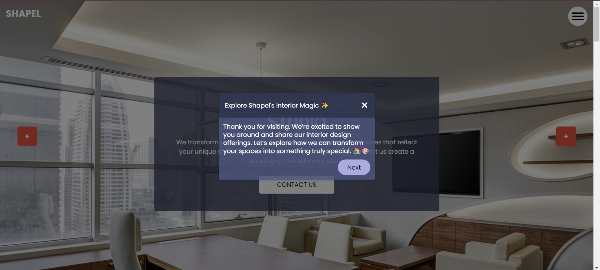
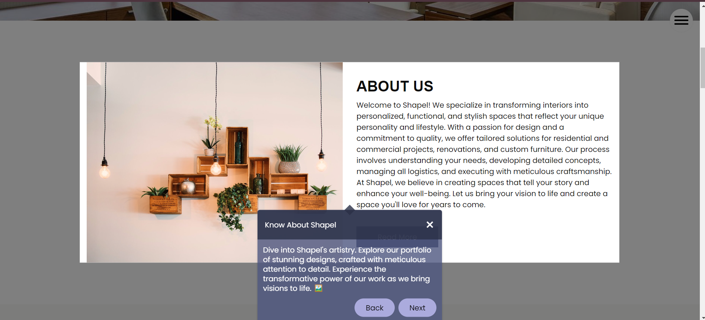
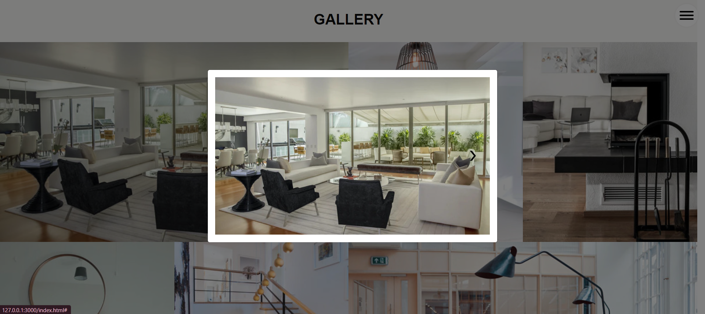

# Shapel - Redefining Interior Design

Welcome to Shapel, your premier destination for innovative and elegant interior design solutions. At Shapel, we believe that every space has the potential to be extraordinary, and we're here to help you bring your vision to life.

## About Shapel
Shapel was founded with a simple yet ambitious goal: to redefine interior design by combining creativity, functionality, and elegance. With a team of passionate designers and craftsmen, we strive to create spaces that inspire and elevate every aspect of your life.

## Our Vision
At Shapel, we envision a world where every space is a masterpiece, where design transcends the ordinary and becomes a reflection of individuality and expression. Our mission is to empower our clients to create spaces that not only look beautiful but also enhance their lives in meaningful ways.

## Tech Stack
Shapel is built on a foundation of cutting-edge technology and innovation. Our tech stack includes:
- **HTML**: Structure your web pages.
- **CSS**: Add style and aesthetics to your designs.
- **JavaScript**: Enhance interactivity and user experience.
- **Shepherd.js**: Guide users through our website with ease.

## Features
- **About Us**: Discover our story, mission, and values.
- **Gallery**: Explore our portfolio of stunning interior designs.
- **Service**: Tailored solutions for residential, commercial, and business spaces.
- **Latest Blog**: Stay updated with our insights, trends, and design tips.
- **Testimonial**: Hear from our satisfied clients and see the impact of our work.

## Video Tour
Check out the video tour to see Shapel in action! 
[Watch Now](https://drive.google.com/file/d/1qUIRO3Cfdwfk6CrdjZIPVHRJ_jvbDzVH/view?usp=sharing)

## Screenshots
Take a look at some screenshots of the website:





## How to Install and Use
1. **Clone the Repository:**
   ```
   git clone https://github.com/yourusername/shapel.git

   ```
2. **Navigate to the Project Directory:**
   ```
   cd shapel

   ```
3. **Open the Website:**
   <br> Open `index.html` in your preferred web browser to explore the Shapel website.</br>

## Join Us
Join us on a journey of discovery and let Shapel redefine your space today. Whether you're a homeowner, business owner, or design enthusiast, we invite you to explore our website, connect with our team, and discover the endless possibilities of interior design.

At Shapel, we don't just create spaces; we create experiences. Let us transform your space into something extraordinary.
